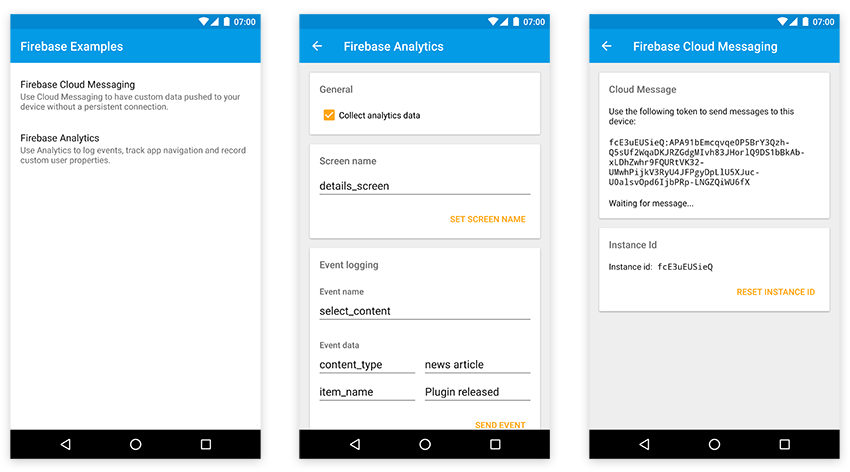

# Tabris.js Firebase Plugin

The `tabris-plugin-firebase` plugin project provides a [Tabris.js](https://tabrisjs.com) API to interact with various [firebase](https://firebase.google.com/) features. The plugin supports [firebase cloud messaging](https://firebase.google.com/docs/cloud-messaging/) and [firebase analytics](https://firebase.google.com/docs/analytics/) with support for more features underway. Currently only Android is supported with iOS support expected in the near future.



## Integrating the plugin
Using the plugin follows the standard cordova plugin mechanism. The Tabris.js website provides detailed information on how to [integrate custom plugins](https://tabrisjs.com/documentation/latest/build#adding-plugins) in your Tabris.js app.

### Add the plugin to your project

The plugin can be added like any other cordova plugin. Either via the `cordova plugin add` command or as an entry in the apps `config.xml` (recommended):

```xml
<!-- THE PLUGIN IS NOT YET AVAILABLE ON NPMJS.COM -->
<!-- <plugin name="tabris-plugin-firebase" spec="1.0.0" /> -->
```

To fetch the latest development version use the GitHub url:

```xml
<plugin name="tabris-plugin-firebase" spec="https://github.com/eclipsesource/tabris-plugin-firebase.git" />
```

#### Provide the firebase credentials

To enable the firebase support in your app, you have to [provide the `google-services.json` file](https://firebase.google.com/docs/android/setup#add_firebase_to_your_app) for Android or [GoogleService-Info.plist file](https://firebase.google.com/docs/ios/setup#add_firebase_to_your_app) for iOS which contains the apps ids and credentials. The file can be obtained from the [firebase console](https://console.firebase.google.com).

To make the `google-services.json` file available to the `tabris-plugins-firebase` you have to place it in the same folder as your apps `config.xml` file. If the file is missing the plugin will print an appropriate error message.

Please include `GoogleService-Info.plist` file as a resource in `config.xml` of your project. You can find out more about including resources [here](https://cordova.apache.org/docs/en/latest/config_ref/#resource-file). Example below:

`<resource-file src="GoogleService-Info.plist" />`

## Documentation

The Tabris.js Firebase Plugin supports the following features

* [Firebase Cloud Messaging](doc/cloud-messaging.md) (Android-only)
* [Firebase Analytics](doc/analytics.md)

## Compatibility

Compatible with [Tabris.js 2.0.0](https://github.com/eclipsesource/tabris-js/releases/tag/v2.0.0)

## Plugin development

While not required by the consumer of the plugin, this repository provides Android specific development artifacts. These artifacts allow to more easily consume the native source code when developing the native parts of the plugin.

### Android

The project provides a gradle based build configuration, which also allows to import the project into Android Studio.

In order to reference the Tabris.js specific APIs, the environment variable `TABRIS_ANDROID_PLATFORM` has to point to the Tabris.js Android Cordova platform root directory.

```bash
export TABRIS_ANDROID_PLATFORM=/home/user/tabris-android
```
 The environment variable is consumed in the gradle projects [build.gradle](project/android/build.gradle) file.

## Copyright

Published under the terms of the [BSD 3-Clause License](LICENSE).
